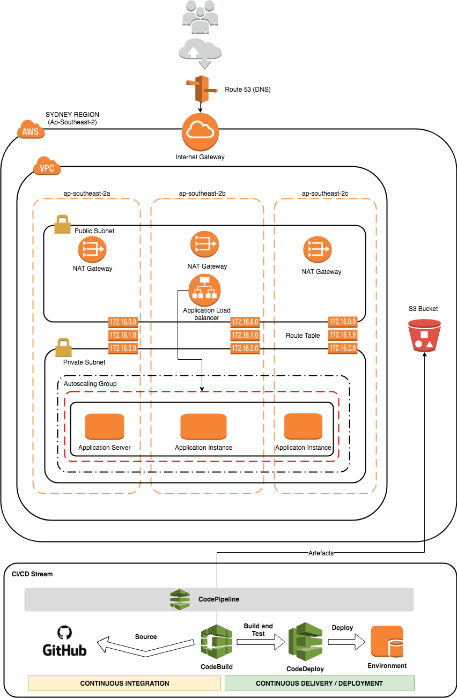

# Infrastructure and CI/CD Architecture

Components:

* [AWS CodePipeline](https://aws.amazon.com/codepipeline/) for pipeline creation.
 * [AWS CodeBuild](https://aws.amazon.com/codebuild/) for testing and building your Go application(s).
 * [AWS CloudFormation](https://aws.amazon.com/cloudformation/) for deploying infrastructure (Infrastructure-as-Code).
 * [AWS CodeDeploy](https://aws.amazon.com/codedeploy/) for zero downtime deployments of your application(s). 

This pipeline allows you easily apply [continuous delivery](https://aws.amazon.com/devops/continuous-delivery/) or [continuous deployment](https://aws.amazon.com/devops/continuous-delivery/) principles to your development lifecycle.

### Infrastructure as code

[AWS CloudFormation](https://aws.amazon.com/cloudformation) will be used to deploy a staging and production environment suitable for hosting Assembly's simple Go application on AWS. This is incorporated into the same pipeline as the application development. Infrastructure for the staging and production environments will be automatically deployed.

This will configure the following:

 - A [VPC](https://aws.amazon.com/vpc), with public and private subnets across multiple [Availability Zones (AZs)](http://docs.aws.amazon.com/AWSEC2/latest/UserGuide/using-regions-availability-zones.html).
 - An [Application load balancer](https://aws.amazon.com/elasticloadbalancing/applicationloadbalancer/) in the public subnets.
 - An [Auto Scaling group](https://aws.amazon.com/autoscaling/) of EC2 instances in private subnets.
 - [NAT gateways](http://docs.aws.amazon.com/AmazonVPC/latest/UserGuide/vpc-nat-gateway.html) to allow outbound internet access from the private subnets.

### Source control

A pipeline will be configured in [AWS CodePipeline](https://aws.amazon.com/codepipeline). It will automatically monitor a [GitHub](https://github.com) repository for modifications to  applications or infrastructure and push them through the delivery pipeline. 

### Build/test
 
[AWS CodeBuild](https://aws.amazon.com/codebuild) will be used to:

 - Run any tests included in the project (using `go test`).
 - Check for code lint errors (using `golint`).
 - Build your Go application.
 - Archive all build artifacts to S3.

To read or modify the [AWS CodeBuild](https://aws.amazon.com/codebuild) configuration, see [buildspec.yml](buildspec.yml).
 

### No downtime on application deployments (staging/production)

Assembly's simple Go web application is included (see [main.go](main.go)). 

When changes are made to the Go application, [AWS CodePipeline](https://aws.amazon.com/codepipeline) will automatically take the changes through the deployment pipeline.

[AWS CodeBuild](https://aws.amazon.com/codebuild) will run all tests, build the application, and then archive successful builds to [Amazon S3](https://aws.amazon.com/s3).

[AWS CodeDeploy](https://aws.amazon.com/codedeploy) will deploy the new application version to the [Auto Scaling group](https://aws.amazon.com/autoscaling) of [Amazon EC2](https://aws.amazon.com/ec2/) instances. By default, [AWS CodeDeploy](https://aws.amazon.com/codedeploy) will use the `CodeDeployDefault.OneAtATime` deployment strategy. However you can modify the [per-environment configuration](#per-environment-configuration) to use any of the strategies listed [here](http://docs.aws.amazon.com/codedeploy/latest/userguide/deployment-configurations.html).

### Manual approval before production 

This pipeline includes an (optional) manual approval stage between the staging and production environments. This can be useful if you are not yet at the stage where you can move to fully automated continuous deployment.

 
## Deployment Procedures

#### 1. Fork this GitHub repository to your GitHub account

This new repository will be used for developing your application, infrastructure, and pipeline (through [AWS CloudFormation](https://aws.amazon.com/cloudformation)).

#### 2. Deploy the pipeline to your AWS account

The pipeline is available as a [AWS CloudFormation](https://aws.amazon.com/cloudformation) template, and included in this repository ([see cloudformation/pipeline.yml](cloudformation/pipeline.yml)). Click the following button to deploy it to your AWS account in the `ap-southeast-2` region:
 
  

You will need to provide some parameters to point [AWS CodePipeline](https://aws.amazon.com/codepipeline) to the repository you forked in your account. 

After the [AWS CloudFormation](https://aws.amazon.com/cloudformation) stack has been created, you will find your new pipeline in the [AWS CodePipeline](https://aws.amazon.com/codepipeline) console.

#### 3. Develop, deploy, iterate!

Now that your pipeline is setup, you can start the fun part:  developing your application! Make some changes to the example Go application in [main.go](main.go), and then commit the changes to your [GitHub](https://github.com) repository.

In the [AWS CodePipeline](https://aws.amazon.com/codepipeline) console, you should see the changes you've made flow through the pipeline.

### Stage: Source

A hook is used to notify [AWS CodePipeline](https://aws.amazon.com/codepipeline) of any updates to your GitHub repository. This will trigger the `Source` stage of your pipeline automatically.

### Stage: Test and Build

[AWS CodeBuild](https://aws.amazon.com/codebuild) will then run your application tests, check code linting and build your application. After a successful build, it will archive the build artifact(s) to the [Amazon S3](https://aws.amazon.com/s3) bucket provided when you deployed your pipeline.

If there are any failures in your test or build process, they will be displayed in the [AWS CodePipeline](https://aws.amazon.com/codepipeline) console. Click on the **Detail** link in the pipeline stage to see the full build log. This will help you identify the reason for the failure.

## Further Improvements to be done

* TLS Certificate Provisioning through ACM
* Enable VPC Flow Logs and GuardDuty for extra level of Security
* Use RDS Instance for Database and Redis for In-Memory Caching
* Use WAF applied to CloudFront or ALB for Layer 7 Security
* More refined IAM roles
* Verbose Logging, Alerting and Dashboards using ELK Stack
* Use ECS Fargate
* Option:  SAM Framework Implementation with CI/CD
* Modularised CloudFormation separating user data config and use Ansible